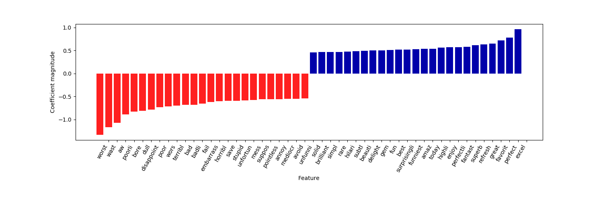
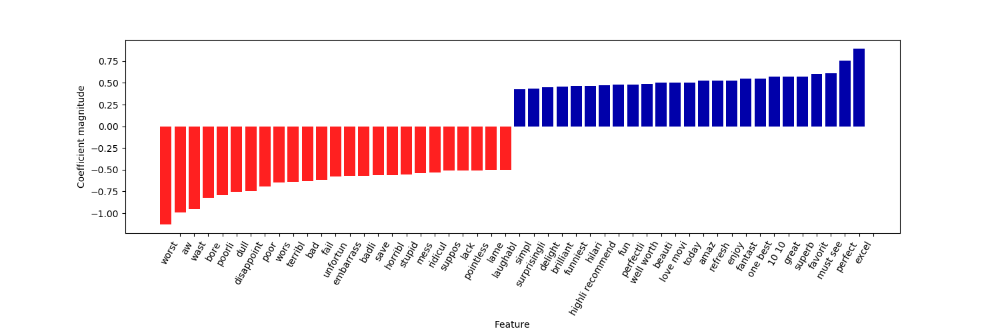
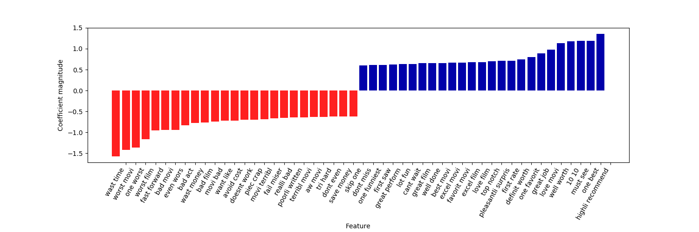

# [Text Mining Project - Sentiment Analysis for movie reviews using Machine Learning Techniques](https://davidschinteie.github.io/proiecte/TextMining/)

### Despre setul de date si prelucrarea acestora:

Revie-urile au fost descarcate de pe [Stanford: Large Movie Review Dataset](http://ai.stanford.edu/~amaas/data/sentiment/) contine un set de training (25k - 12.5k pozitive si 12.5k negative) si un set de testare (25k - 12.5k pozitive si 12.5k negative).

***

### 1) Curatarea si prelucrarea datelor

full_test.txt: 12500 review-uri pozitive si 12500 review-uri negative pentru testare

full_train.txt: 12500 review-uri pozitive si 12500 review-uri negative pentru training/invatare

Accuracy: 0.88152 - capture01_b.png

Side note: pentru testarea codului au fost folosite seturi de cate 200 de review-uri (100 pozitive si 100 negative: small_test.txt si small_train.txt) pentru partea de dezvoltare si numai la final au fost folosite seturile de date de 25k de revie-uri. In cazul in care sunt folosite seturile de 200 de review-uri matricea target trebuie recreata astfel:

```
target = [1 if i < 100 else 0 for i in range(200)]
```

in loc de:

```
target = [1 if i < 12500 else 0 for i in range(25000)]
```

***

#### 1.a) Etapa1: review-urile din full_test curatate de taguri HTML, de semne de punctatie, au fost reduse la lower-case (etapa 1) cleaned_small_test_v1.txt (fisier cu primele 200 de revie-uri prelucrate)

Astfel ca urmatorul comentariu:

> "I went and saw this movie last night after being coaxed to by a few friends of mine. I'll admit that I was reluctant to see it because from what I knew of Ashton Kutcher he was only able to do comedy. I was wrong. Kutcher played the character of Jake Fischer very well, and Kevin Costner played Ben Randall with such professionalism. The sign of a good movie is that it can toy with our emotions. This one did exactly that. The entire theater (which was sold out) was overcome by laughter during the first half of the movie, and were moved to tears during the second half. While exiting the theater I not only saw many women in tears, but many full grown men as well, trying desperately not to let anyone see them crying. This movie was great, and I suggest that you go see it before you judge."

a fost prelucrat in urmatoarea forma:

> "i went and saw this movie last night after being coaxed to by a few friends of mine ill admit that i was reluctant to see it because from what i knew of ashton kutcher he was only able to do comedy i was wrong kutcher played the character of jake fischer very well and kevin costner played ben randall with such professionalism the sign of a good movie is that it can toy with our emotions this one did exactly that the entire theater which was sold out was overcome by laughter during the first half of the movie and were moved to tears during the second half while exiting the theater i not only saw many women in tears but many full grown men as well trying desperately not to let anyone see them crying this movie was great and i suggest that you go see it before you judge"

***

#### 1.b) In etapa 2 au fost eliminate stopwords si cuvintele au fost normalizate (eliminarea terminatiilor diferite pentru acelasi cuvant de baza)

Astfel ca primul comentariu a fost prelucrat in urmatoarea forma:

> "went saw movi last night coax friend mine ill admit reluct see knew ashton kutcher abl comedi wrong kutcher play charact jake fischer well kevin costner play ben randal profession sign good movi toy emot one exactli entir theater sold overcom laughter first half movi move tear second half exit theater saw mani woman tear mani full grown men well tri desper let anyon see cri movi great suggest go see judg"

Accuracy: 0.87676 - capture02_b.png

### 2) Aplicarea algoritmului Logistic Regression

#### 2.a) Creearea dictionarului de date:

Este creat un vector cu toate cuvintele unice din cele 50 de mii de review-uri (un fel de dictionar de date - initial acesta contine toate cuvintele unice care apar cel putin o data insa pentru varianta cu min_df ( = 5) setat ca parametru dictionarul de date dictionarul de date va contine cuvinte(sau grupuri de cuvinte) care apar de cel putin 5 ori => Creste scorul acuratetii)

#### 2.b) Vectorizarea datelor:

Pentru a putea transmite datele algoritmului de machine learning va trebui sa asociem fiecarui review un numar pentru o reprezentare vectoriala a datelor.

algoritmul creeaza o matrice cu o coloana pentru fiecare cuvant unic din cele 50k de revie-uri. Apoi convertim fiecare review in parte intr-un singur rand cu 0 si 1 - unde 1 inseamna ca respectivul cuvant din coloana matricii apare in review. Asta inseamna ca fiecare rand din matrice va fi majoritar completata cu valoarea 0. Proces cunoscut si sub numele de one hot encoding.

### 3) Alegerea parametrilor pentru Vectorizare:

#### 3.a) Alegerea parametrului C (1/lambda):

Pentru valori mici ale lui C creste valoarea lui lambda care va face ca modelul sa fie foarte simplu (underfit data) -- daca in schimb C are valori foarte mari atunci lambda va lua valori foarte mici ceea ce va creste complexitatea modelului (overfit data).

Se va testa setul de date cu diferite valori ale lui C (0.01, 0.05, 0.25, 0.5, 1) si se alege valoarea corespunzatoare celui mai mare scor al acuratetii.

In cazul acestui set de date rezultatele obtinute pentru C au fost:

Accuracy for C=0.01: 0.87104
Accuracy for C=0.05: 0.87376
Accuracy for C=0.25: 0.86784
Accuracy for C=0.5: 0.86544
Accuracy for C=1: 0.86336

Rezulta ca C=0.05 va fi ales ca valoare -> capture02_b.png

#### 3.b) min_df ( = 5): parametru care stabileste frecventa minima a unui cuvant inainte a fi setat drept feature

#### 3.c) ngram_range=(1, 2): parametru care defineste lungimea maxima si minima a unui set de cuvinete care pot fi setate drept features

| Cazul 1 | Cazul 2 | Cazul 3 |
| --- | --- | --- |
| CountVectorizer(binary=True) | CountVectorizer(binary=True, min_df=5, ngram_range=(1, 2)) | CountVectorizer(binary=True, min_df=5, ngram_range=(2, 2)) |
| Accuracy: 0.87676 | Accuracy: 0.88736 | Accuracy: 0.84848 |
| capture03_a.png | capture03_b.png | capture03_c.png |

Comentariu pentru cazul 3: Acuratetea scade pentru ca are la dispozitie mai putine date (nu mai poate sa foloseasca cuvintele izolate ci doar in grupuri de cate 2)

### 4) Verificarea:

#### Vizualizarea celor mai discriminatorii cuvinte (seturi de cuvinte) alese de algoritm in declararea review-urilor pozitive si celor negative (primele 25 de feature-uri):



Cazul 1: capture03_a



Cazul 2: capture03_b



Cazul 3: capture03_c

## Useful Links for project:

### Getting data:

[Stanford: Large Movie Review Dataset (50.000 de revie-uri)](http://ai.stanford.edu/~amaas/data/sentiment/)

Alternativa (cu mult mai putine review-uri - 700): [Movie Review Data - Cornell](http://www.cs.cornell.edu/people/pabo/movie-review-data/)

### Tutorials links:

[Sentiment Analysis with Python (Part 1) - Classifying IMDb Movie Reviews](https://towardsdatascience.com/sentiment-analysis-with-python-part-1-5ce197074184)

[Sentiment Analysis with Python (Part 2) - Improving a Movie Review Sentiment Classifier](https://towardsdatascience.com/sentiment-analysis-with-python-part-2-4f71e7bde59a)

[Machine Learning: Sentiment analysis of movie reviews using Logistic Regression](https://itnext.io/machine-learning-sentiment-analysis-of-movie-reviews-using-logisticregression-62e9622b4532)

### Alte link-uri (just for fun 😃)

[Logistic Regression from scratch in Python](https://medium.com/@martinpella/logistic-regression-from-scratch-in-python-124c5636b8ac)

[Natural Language Processing and Sentiment Analysis with Python](https://www.pythonforengineers.com/natural-language-processing-and-sentiment-analysis-with-python/)

[Simplifying Sentiment Analysis in Python](https://www.datacamp.com/community/tutorials/simplifying-sentiment-analysis-python)

[Python Sentiment Analysis](https://pythonspot.com/python-sentiment-analysis/)

[Python - Sentiment Analysis (tutorialspoint)](https://www.tutorialspoint.com/python/python_sentiment_analysis.htm)

### Remaining Todos:

#### Must do: 🔺

In cazul stopwords-urilor trebuie ales un sir custom de cuvinte intrucat cel standard (folosit in program) include si cuvinte precum "not" sau "didn't" care scad scorul acuratetii in loc sa-l imbunatateasca! - un posibil sir alternativ de stopwords ar fi: ['in','of','at','a','the']

#### Optimizare: 🏅

Suplimentar de implementat Cazul 4 si pentru parametrul ngram_range=(1, 3) - seturi de cate 3 cuvinte.

#### Geek: 🤓

Algoritmul 2 in plus fata de Logistic Regression s-ar putea incerca un alt algoritm Support Vector Machines si ar putea fi facute comparatii intre cele 2.
